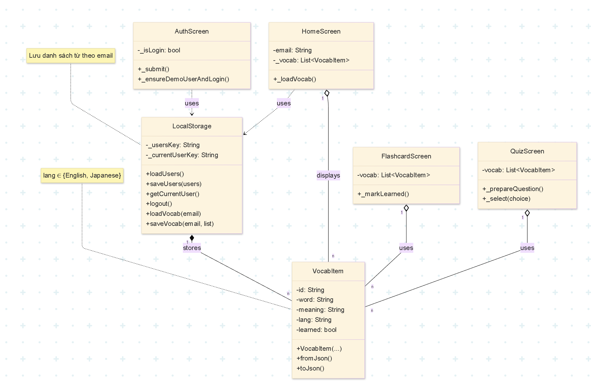

# Language Flashcards App 

Ứng dụng **Language Flashcards** là một công cụ học từ vựng ngoại ngữ tiện lợi và trực quan, được phát triển hoàn toàn trên nền tảng **Flutter**. Mục tiêu chính là cung cấp một giải pháp học tập cá nhân hóa, giúp người dùng lưu trữ, ôn tập và kiểm tra kiến thức từ vựng (ví dụ: Tiếng Anh và Tiếng Nhật) một cách hiệu quả và hoàn toàn ngoại tuyến.

Ứng dụng sử dụng tông màu chủ đạo là **Xanh Dương Nhạt (Light Blue)** và màu nhấn **Hồng (Pink Accent)**, mang lại trải nghiệm tươi sáng và thân thiện.

---

## Thông tin Nhóm Phát triển (Team Information)

Đề tài được thực hiện bởi nhóm sinh viên:

| Họ và Tên | Mã Số Sinh Viên (MSV) |
| :--- | :--- |
| **Nguyễn Mai Anh** | 23010490 |
| **Nguyễn Dương Ngọc Ánh** | 23011500 |

---

## Lý do Thực hiện Đề tài (Motivation)

Đề tài này được thực hiện nhằm giải quyết các thách thức phổ biến mà người học ngoại ngữ thường gặp phải và khám phá tiềm năng của Flutter trong phát triển ứng dụng giáo dục:

1.  **Nhu cầu ôn tập chủ động:** Các phương pháp học truyền thống thường thiếu tính cá nhân hóa. Ứng dụng cung cấp công cụ Flashcards và Quiz, giúp người học tự kiểm tra và củng cố từ vựng một cách chủ động theo nhịp độ riêng.
2.  **Thiếu công cụ Offline:** Nhiều ứng dụng học từ vựng yêu cầu kết nối mạng để lưu trữ và truy cập dữ liệu. Dự án này tận dụng `shared_preferences` để đảm bảo người dùng có thể học tập liên tục, mọi lúc mọi nơi mà không cần internet.
3.  **Thực hành Flutter và UI/UX:** Dự án là cơ hội để áp dụng các kiến thức về Framework Flutter, đặc biệt là:
    * **Quản lý trạng thái đơn giản:** Sử dụng `StatefulWidget` và `setState` hiệu quả.
    * **Thiết kế thân thiện:** Áp dụng giao diện Material 3 với bảng màu tươi sáng (Xanh Dương - Hồng) để cải thiện trải nghiệm người dùng.
4.  **Phân loại rõ ràng:** Thiết kế hệ thống theo dõi tiến độ tách biệt cho từng ngôn ngữ (English, Japanese) giúp người dùng quản lý mục tiêu học tập một cách rõ ràng và có tổ chức.

---

## Sơ đồ Use case

<p align="center">
  
</p>

## Class diagram

<p align="center">
  
</p>

##  Cấu trúc dự án

. ├── lib/ │ ├── about_us.dart # Màn hình Giới thiệu (About Us). │ └── main.dart # Tệp chính chứa toàn bộ logic, màn hình, và các lớp hỗ trợ: │ ├── (Classes/Models) │ │ ├── VocabItem # Lớp Model: Định nghĩa cấu trúc của một từ vựng. │ │ └── LocalStorage # Lớp Helper: Quản lý lưu trữ và tải dữ liệu bằng shared_preferences. │ ├── (Screens/Routes) │ │ ├── SplashOrLogin # Màn hình tải ban đầu, kiểm tra trạng thái đăng nhập. │ │ ├── AuthScreen # Logic Đăng nhập/Đăng ký và Tài khoản Demo. │ │ ├── HomeScreen # Màn hình chính (Dashboard) và hiển thị Tiến độ. │ │ ├── ManageVocabScreen # Màn hình quản lý chi tiết danh sách từ vựng. │ │ ├── AddEditVocabScreen # Màn hình thêm mới hoặc chỉnh sửa từ vựng. │ │ ├── FlashcardScreen # Màn hình ôn tập bằng thẻ từ. │ │ └── QuizScreen # Màn hình kiểm tra trắc nghiệm. ├── pubspec.yaml # Định nghĩa dependencies (quan trọng nhất là shared_preferences). └── README.md

---

##  Hướng dẫn Cài đặt & Khởi chạy

### Yêu cầu

* Flutter SDK (phiên bản ổn định)
* Dart SDK

### Các bước thực hiện

1.  **Clone repository** (Thay thế `[URL_REPOSITORY]` bằng liên kết GitHub ) / **Tải file zip từ github repo**
    ```bash
    git clone [URL_REPOSITORY]
    cd language_flashcards_app
    ```
2.  **Tải dependencies:**
    ```bash
    flutter pub get
    ```
3.  **Chạy ứng dụng:**
    ```bash
    flutter run
    ```

## Triển vọng Phát triển (Future Scope)

Để mở rộng và nâng cao giá trị của ứng dụng, các tính năng sau có thể được xem xét và tích hợp trong tương lai:

1.  **Hỗ trợ đa ngôn ngữ chuyên sâu:**
    * Mở rộng sang các ngôn ngữ khác (ví dụ: Hàn, Trung, Tây Ban Nha).
    * Tích hợp trường lưu trữ cho **ví dụ câu** hoặc **phát âm** (sử dụng thư viện Text-to-Speech).
2.  **Nâng cấp Quản lý Dữ liệu:**
    * Chuyển từ `shared_preferences` sang cơ sở dữ liệu cục bộ mạnh mẽ hơn như **SQLite/Hive/Isar** để xử lý lượng từ vựng lớn hơn và các truy vấn phức tạp hơn.
    * Thêm chức năng **Nhập/Xuất file CSV** để người dùng dễ dàng di chuyển từ vựng.
3.  **Cải thiện Thuật toán Ôn tập:**
    * Áp dụng thuật toán lặp lại ngắt quãng (Spaced Repetition System - **SRS**) để tối ưu hóa thời điểm ôn tập dựa trpnj
